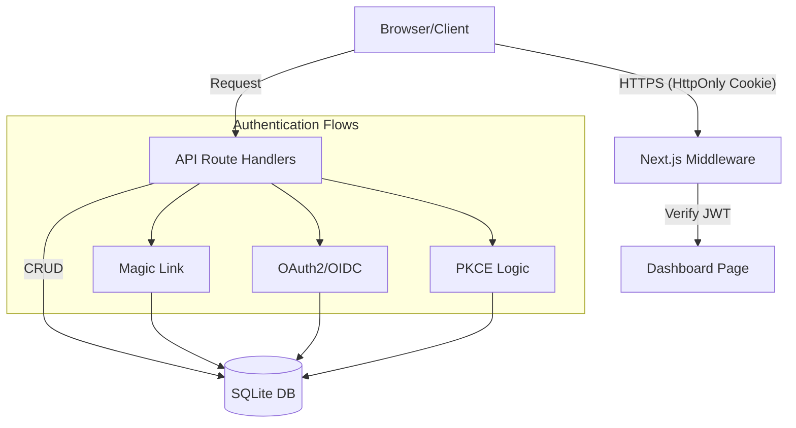

# 📖 Tài Liệu Mô Tả Hệ Thống — AuthFlow Demo

## 1. Tổng quan hệ thống

**AuthFlow Demo** là một ứng dụng web giáo dục được xây dựng để minh họa và demo các luồng xác thực (Authentication) và ủy quyền (Authorization) hiện đại. Hệ thống tích hợp một backend thực tế sử dụng Next.js API Routes và cơ sở dữ liệu SQLite để người dùng có thể quan sát quá trình xử lý dữ liệu thực tế thay vì chỉ là các giả lập UI tĩnh.

### Mục đích chính:

- Minh họa luồng **Magic Link** (Passwordless).
- Trình diễn cơ chế **OAuth2** (với Google, GitHub) cả ở dạng Mock (mô phỏng) và Real (thực tế).
- Giải thích chuẩn **Authorization Code Flow**, **PKCE**, và **OIDC**.
- Thực hành các tiêu chuẩn bảo mật như **Token Introspection** (RFC 7662) và **Token Revocation** (RFC 7009).

---

## 2. Kiến trúc Ứng dụng

Ứng dụng tuân thủ mô hình **Monolithic Next.js Architecture** sử dụng App Router:

- **Frontend**: React.js với Tailwind CSS v4, Framer Motion cho animation và shadcn/ui cho component.
- **Backend**: API Route Handlers (Edge-compatible logic nhưng chạy trên Node.js runtime để sử dụng SQLite).
- **Database**: SQLite (`better-sqlite3`) — Một file database duy nhất giúp dễ dàng triển khai.
- **Core Libraries (`/lib`)**:
  - `db.ts`: Quản lý kết nối và schema SQLite.
  - `jwt.ts`: Xử lý sign/verify token bằng bộ thư viện `jose`.
  - `logger.ts`: Hệ thống ghi log server hiển thị ra giao diện.
  - `session.ts`: Quản lý session phía client và server.

---

## 3. Sơ đồ kiến trúc (Architecture Diagram)

---

## 4. Cấu trúc Cơ sở dữ liệu (SQLite)

Hệ thống sử dụng file `auth_demo.db` với các bảng chính sau:

| Bảng              | Mô tả                                                        |
| :---------------- | :----------------------------------------------------------- |
| `users`           | Lưu trữ thông tin người dùng (Email, Name, Provider ID).     |
| `magic_tokens`    | Lưu các mã dùng một lần cho luồng đăng nhập qua email.       |
| `oauth_states`    | Quản lý tham số `state` để chống tấn công CSRF trong OAuth2. |
| `pkce_challenges` | Lưu trữ code challenge và verifier phục vụ luồng PKCE.       |
| `auth_codes`      | Lưu mã Authorization Code tạm thời trước khi đổi lấy Token.  |
| `refresh_tokens`  | Quản lý token làm mới phiên đăng nhập.                       |
| `revoked_tokens`  | Danh sách đen các token đã bị thu hồi (Blacklist hash).      |

---

## 5. Các Luồng Nghiệp Vụ Chính

### 5.1. Magic Link Flow

1. Người dùng nhập Email.
2. Server tạo một token ngẫu nhiên, lưu vào `magic_tokens` và gửi qua email (hoặc in ra Terminal).
3. Người dùng click vào link.
4. Server xác thực token, nếu hợp lệ sẽ tạo JWT và set vào Cookie tên là `auth_token`.

### 4.2. Authorization Code Flow (OAuth2)

1. Redirect người dùng tới Auth Server (Google/GitHub/Mock).
2. Người dùng đồng ý cấp quyền.
3. Auth Server trả về `code` qua Redirect URI.
4. Backend đổi `code` lấy `access_token` và `id_token` thông qua kênh Server-to-Server.

### 4.3. PKCE (Proof Key for Code Exchange)

Được sử dụng cho các ứng dụng Client-side (như SPA này) để bảo mật hơn:

1. Client tạo `code_verifier` và hash nó thành `code_challenge`.
2. Gửi `code_challenge` trong bước Authorization.
3. Khi đổi token, gửi kèm `code_verifier` để server đối chiếu, đảm bảo Client nhận code chính là Client đã yêu cầu code.

---

## 6. Danh Mục API (Endspoints)

### Authentication

- `POST /api/auth/magic-link`: Tạo link đăng nhập.
- `GET /api/auth/magic-link/verify`: Xác thực token từ email.
- `GET /api/auth/logout`: Xóa session cookie.

### OAuth2 / OIDC

- `GET /api/auth/oauth/google`: Bắt đầu luồng Google.
- `GET /api/auth/oauth/callback`: Xử lý dữ liệu trả về từ các Provider.
- `GET /api/auth/oidc/.well-known/openid-configuration`: Tài liệu cấu hình OIDC.

### Security Tools

- `POST /api/auth/introspect`: Kiểm tra tính hợp lệ của Token.
- `POST /api/auth/revoke`: Thu hồi Token.
- `GET /api/auth/protected-resource`: API giả lập yêu cầu quyền truy cập.

---

## 7. Bảo mật (Security Best Practices)

- **HttpOnly & Secure Cookies**: Token không thể truy cập từ JavaScript, ngăn chặn đánh cắp Session.
- **CSRF Protection**: Sử dụng tham số `state` trong OAuth2.
- **Token Blacklisting**: Các token đã revoke được băm (hash) và lưu vào DB để từ chối các request sau đó.
- **Middleware Guard**: Kiểm tra JWT cho tất cả request tới `/dashboard`.

---

## 8. Giao diện (User Interface)

Hệ thống được thiết kế theo phong cách hiện đại:

- **Glassmorphism**: Hiệu ứng kính mờ cho các card.
- **Server Logs Panel**: Hiển thị quá trình xử lý của Server theo thời gian thực (real-time stream simulation).
- **Interactive Diagrams**: Sơ đồ động giải thích các bước của giao thức.
- **Dark Mode**: Tối ưu cho trải nghiệm lập trình viên.

---

_Tài liệu này cung cấp cái nhìn tổng thể về cách AuthFlow Demo vận hành. Để biết cách cài đặt, tham khảo [USER_GUIDE.md](./USER_GUIDE.md)._
